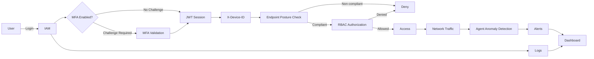

# Product Requirements Document (PRD)

## 1. Background & Context

### 1.1 Market Analysis

* **Insider threat prevalence:** Internal actors contribute to ~35% of security breaches.
* **Credential abuse:** >60% of breaches involve stolen, weak, or misused credentials; credential abuse remains the top initial access vector (~22%).
* **Operational visibility gap:** ~73% of internal security incidents stem from employee misconfiguration or misuse that goes undetected.

**Pain Points:**

* Overreliance on perimeter-based security models
* Lack of continuous identity and device verification

### 1.2 Product Objectives & KPIs

**Primary Objectives:**

1. Enforce identity-centric access control using MFA and RBAC.
2. Validate endpoint security posture before granting access.
3. Detect anomalous internal network behavior.
4. Provide centralized, actionable security visibility.

**Key KPIs:**

* ≥95% authentication attempts protected by MFA
* ≥90% endpoint compliance detection accuracy (simulated environment)
* ≥80% precision in detecting injected anomalous traffic patterns
* Target <2s dashboard data refresh latency; current frontend prototype uses 10s polling for most dashboard/security pages
* 100% access events logged and auditable

### 1.3 User Personas

**Persona 1: IT Administrator**

* Role: IT Admin / Security Engineer
* Environment: <500 endpoints, limited security budget
* Needs: Visibility, control, low operational overhead

**Persona 2: Internal Employee (End User)**

* Role: General staff, developers, operations
* Needs: Minimal friction authentication, clear access boundaries

---

## 2. Features & Functional Scope

### 2.1 Core Modules

#### 1. Identity & Access Management (IAM)

* Local user credential store
* Password-based authentication
* MFA (TOTP-based)
* Role-Based Access Control (RBAC)
* JWT-based session management with access and refresh tokens
* Full access and authentication logging
* Prototype protected-resource access flow using MFA + RBAC + compliant-device gate

#### 2. Endpoint Posture Verification

* Client-side posture reporting (cooperative model)
* OS version detection
* Hostname, architecture, uptime, boot time, and network interface collection
* Firewall status check
* Antivirus presence check
* Disk encryption status check
* Patch/update status target, currently best-effort/prototype-level
* Pre-access compliance evaluation
* Periodic posture re-validation

#### 3. Network Traffic Monitoring & Anomaly Detection

* Internal traffic capture (simulated network between VMs and host)
* Session metadata extraction (no payload capture)
* Agent-side feature engineering per batch:
  - Packets/bytes per minute
  - Unique destination count
  - Port distribution analysis
  - TCP flag ratios
* Agent-side anomaly detection using a local model artifact when available
* Heuristic fallback for prototype detection when the model artifact is unavailable
* Traffic and alert reporting to central backend

#### 4. Anomaly Detection Engine

* Target model: pre-trained Isolation Forest trained on public labeled dataset
* Current implementation supports generic joblib model loading plus heuristic fallback
* Separate `/ids` workspace supports supervised flow-based binary classification experiments using Random Forest, XGBoost, and MLP
* Edge-based detection (runs on agent, not backend)
* Detection of:

  * Brute-force attempts
  * Abnormal access frequency
  * Data exfiltration patterns
  * Port scanning behavior
* Configurable detection thresholds
* Alert generation with severity levels

#### 5. Administrative Dashboard

* Unified login for administrators
* Real-time logs and alerts
* Endpoint compliance overview
* Current anomaly display through metrics/tables; target anomaly visualization includes charts and richer trend views
* Basic alert acknowledgment workflow
* Protected Files demo page for validating the full access-control chain

---

### 2.2 Innovative / Differentiating Features

1. **Software-Only Zero-Trust Architecture**

   * No hardware dependencies (TPM, secure boot excluded)
   * Fully deployable in virtualized SME environments

2. **Integrated Internal Visibility**

   * Identity + device posture + traffic behavior in one platform
   * Single-pane-of-glass security monitoring

3. **Explainable Anomaly Detection**

   * Detection outputs include reason codes (e.g., spike, deviation score)
   * Improves administrator trust and decision-making

---

## 3. User Flows

### 3.1 New User Onboarding

1. Admin creates user account and assigns role
2. User sets password
3. MFA enrollment (TOTP QR code)
4. First successful authenticated session

### 3.2 Primary Access Flow

1. User attempts login
2. Credential verification
3. MFA challenge if MFA is enabled for the user
4. JWT access and refresh tokens issued after successful authentication
5. Protected resource request includes selected/registered device identifier via `X-Device-ID`
6. Endpoint posture compliance check
7. RBAC authorization decision
8. Access granted / denied
9. Event logged

**Target enhancement:** trusted-device tokens may later support 30-day MFA bypass. The current prototype does not yet implement `device_token`-based MFA bypass.

### 3.3 Security Monitoring Flow

1. Agent captures traffic
2. Agent extracts features (per 60s batch)
3. Agent runs anomaly detection locally using a model if available, otherwise heuristic fallback
4. If anomaly: Agent generates alert with severity and reason codes
5. Agent POSTs traffic batch + alerts to backend when reporting is enabled
6. Dashboard displays alerts and traffic history

---

## 4. Business Flow

**Integration Points:**

* IAM ↔ Dashboard
* Posture Module ↔ IAM
* Traffic Monitor ↔ Anomaly Engine

---

## 5. Development Plan

### Phase Breakdown

| Phase             | Scope                            |
| ----------------- | -------------------------------- |
| P0 – MVP          | IAM, MFA, RBAC, basic dashboard  |
| P1 – Enhancement  | Endpoint posture checks, logging |
| P2 – Optimization | Anomaly detection, tuning        |
| P3 – Innovation   | Explainability, UI refinement    |

**Prioritization Rationale:**

* Identity enforcement is foundational (P0)
* Posture validation strengthens Zero-Trust guarantees (P1)
* Behavioral detection adds advanced security value (P2)
* UX and explainability improve usability (P3)

---

## 6. Technical Requirements

### 6.1 Architecture Overview

* Modular, service-oriented design
* Central backend with REST APIs (storage and dashboard serving)
* Web-based frontend dashboard
* Edge-based processing: Agents perform feature engineering and ML inference locally
* Target: pre-trained ML model shipped with agent (no runtime training)
* Current: agent loads a local joblib model when present and falls back to heuristic detection when absent
* Agent reporting endpoints currently include `POST /api/devices`, `POST /api/devices/{device_id}/posture`, `POST /api/traffic`, and `POST /api/alerts`
* Simulated endpoints and network

### 6.2 Technology Stack

* Backend: Python 3.13+ currently (FastAPI, SQLAlchemy, Pydantic)
* Frontend: React 19 + TypeScript 6 (Vite 8, TanStack Query, Tailwind CSS 4)
* Frontend routing/state/forms: React Router 7, Zustand, React Hook Form, Zod, Axios
* Database: SQLite
* Auth: JWT (python-jose), TOTP (pyotp), Argon2id (passlib)
* Agent runtime: Python 3.14+ currently (httpx, psutil, scapy, Pydantic, joblib)
* IDS workspace: Python 3.13+ currently (pandas, numpy, scikit-learn, XGBoost, joblib)
* ML target: pre-trained Isolation Forest for endpoint anomaly detection
* ML current: generic joblib model support, heuristic fallback in agent, supervised classifier experiments in `/ids`
* Tooling: uv, ruff, mypy, pytest, ESLint, TypeScript

### 6.3 Performance Requirements

* Authentication response time: <500ms
* Dashboard load time: <2s
* Anomaly detection batch latency: <5s

### 6.4 Security & Compliance

* Password hashing (Argon2id)
* Encrypted communication (TLS)
* Secure token storage target; current frontend prototype persists tokens in client-side storage and should be hardened later
* Device trust tokens (30-day MFA bypass) target; not implemented in current prototype
* Audit-ready structured logs

### 6.5 Current Implementation / Prototype Deviations

The current implementation intentionally differs from the target PRD in several areas. These gaps should be resolved later so the implementation and PRD align perfectly.

* **Device trust token flow:** The target 30-day trusted-device MFA bypass is not implemented yet. Current login uses password + MFA challenge, while protected-resource access checks device compliance using an `X-Device-ID` header.
* **Agent authentication:** Current agent backend reporting uses a user JWT access token. A dedicated agent identity/token model is still needed for production-like deployment.
* **Posture reporting endpoint:** Current posture submission is nested under devices: `POST /api/devices/{device_id}/posture`, not a standalone `POST /api/posture` endpoint.
* **Posture fidelity:** Firewall, antivirus, and disk encryption are implemented as best-effort checks. Patch/update status is currently incomplete and may be reported conservatively.
* **Anomaly model:** The PRD target remains a shipped pre-trained Isolation Forest model. Current agent code supports local joblib inference but uses heuristic fallback if the model artifact is missing.
* **IDS workspace:** `/ids` is separate from the runtime agent. It currently supports CICFlowMeter-style flow CSV training/inference and supervised classifiers (Random Forest, XGBoost, MLP) for experimentation and attack-simulation evaluation.
* **Dashboard visualization:** Current frontend uses polling, metrics, forms, and tables. Rich chart-based anomaly visualization is still a target enhancement.
* **Frontend token storage:** Current prototype persists auth state client-side for usability. Secure/hardened token storage remains a future security hardening item.
* **Runtime/service deployment:** The agent currently runs as a Python process. Managed systemd/Windows Service packaging remains a deployment target.

**Known Limitations & Mitigation:**

* Cooperative posture reporting → clearly documented trust assumptions
* No hardware-backed attestation → simulation scope only
* Prototype agent authentication uses user JWTs → replace with dedicated agent identity/token model
* Missing model artifact falls back to heuristics → ship and validate the target model artifact before final evaluation
* Pre-trained/public-dataset model → may not cover all attack patterns
* No cross-device correlation → agent-based detection is per-endpoint only

---

## 7. Success Metrics

* Authentication success/failure rate
* MFA adoption rate
* Endpoint compliance percentage
* True/false positive anomaly rates
* Dashboard usage frequency

---
