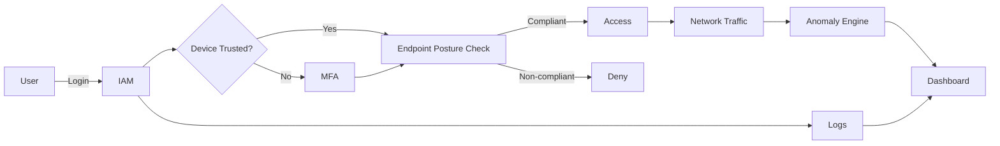

# Product Requirements Document (PRD)

---

## Document Header

* **Product Name:** Zero-Trust Security Suite (ZT Suite)
* **Industry:** Cybersecurity (Network & Cloud Security, Cryptography & Data Security)
* **Document Version:** v1.0
* **Creation Date:** 2026-01-07
* **Product Manager:** Tan Jin Yi
* **Review Status:** Draft – Pending Supervisor Review

---

## 1. Background & Context

### 1.1 Market Analysis

* **Insider threat prevalence:** Internal actors contribute to ~35% of security breaches.
* **Credential abuse:** >60% of breaches involve stolen, weak, or misused credentials; credential abuse remains the top initial access vector (~22%).
* **Operational visibility gap:** ~73% of internal security incidents stem from employee misconfiguration or misuse that goes undetected.

**Pain Points:**

* Overreliance on perimeter-based security models
* Lack of continuous identity and device verification

### 1.2 Product Objectives & KPIs

**Primary Objectives:**

1. Enforce identity-centric access control using MFA and RBAC.
2. Validate endpoint security posture before granting access.
3. Detect anomalous internal network behavior.
4. Provide centralized, actionable security visibility.

**Key KPIs:**

* ≥95% authentication attempts protected by MFA
* ≥90% endpoint compliance detection accuracy (simulated environment)
* ≥80% precision in detecting injected anomalous traffic patterns
* <2s dashboard data refresh latency
* 100% access events logged and auditable

### 1.3 User Personas

**Persona 1: IT Administrator**

* Role: IT Admin / Security Engineer
* Environment: <500 endpoints, limited security budget
* Needs: Visibility, control, low operational overhead

**Persona 2: Internal Employee (End User)**

* Role: General staff, developers, operations
* Needs: Minimal friction authentication, clear access boundaries

---

## 2. Features & Functional Scope

### 2.1 Core Modules

#### 1. Identity & Access Management (IAM)

* Local user credential store
* Password-based authentication
* MFA (TOTP-based)
* Role-Based Access Control (RBAC)
* JWT-based session management
* Full access and authentication logging

#### 2. Endpoint Posture Verification

* Client-side posture reporting (cooperative model)
* OS version detection
* Patch level and update status
* Antivirus presence check
* Pre-access compliance evaluation
* Periodic posture re-validation

#### 3. Network Traffic Monitoring & Anomaly Detection

* Internal traffic capture (simulated network between VMs and host)
* Session metadata extraction (no payload capture)
* Agent-side feature engineering per batch:
  - Packets/bytes per minute
  - Unique destination count
  - Port distribution analysis
  - TCP flag ratios
* Agent-side anomaly detection using pre-trained Isolation Forest
* Traffic and alert reporting to central backend

#### 4. Anomaly Detection Engine

* Pre-trained Isolation Forest model (trained on public labeled dataset)
* Edge-based detection (runs on agent, not backend)
* Detection of:

  * Brute-force attempts
  * Abnormal access frequency
  * Data exfiltration patterns
  * Port scanning behavior
* Configurable detection thresholds
* Alert generation with severity levels

#### 5. Administrative Dashboard

* Unified login for administrators
* Real-time logs and alerts
* Endpoint compliance overview
* Anomaly visualization (charts, tables)
* Basic alert acknowledgment workflow

---

### 2.2 Innovative / Differentiating Features

1. **Software-Only Zero-Trust Architecture**

   * No hardware dependencies (TPM, secure boot excluded)
   * Fully deployable in virtualized SME environments

2. **Integrated Internal Visibility**

   * Identity + device posture + traffic behavior in one platform
   * Single-pane-of-glass security monitoring

3. **Explainable Anomaly Detection**

   * Detection outputs include reason codes (e.g., spike, deviation score)
   * Improves administrator trust and decision-making

---

## 3. User Flows

### 3.1 New User Onboarding

1. Admin creates user account and assigns role
2. User sets password
3. MFA enrollment (TOTP QR code)
4. First successful authenticated session

### 3.2 Primary Access Flow

1. User attempts login
2. Credential verification
3. Device trust check (skip MFA if trusted device token valid)
4. MFA challenge (if device not trusted)
5. Endpoint posture check
6. RBAC authorization decision
7. Access granted / denied
8. Event logged

### 3.3 Security Monitoring Flow

1. Agent captures traffic
2. Agent extracts features (per 60s batch)
3. Agent runs anomaly detection (local inference)
4. If anomaly: Agent generates alert
5. Agent POSTs traffic batch + alerts to backend
6. Dashboard displays alerts and traffic history

---

## 4. Business Flow

**Integration Points:**

* IAM ↔ Dashboard
* Posture Module ↔ IAM
* Traffic Monitor ↔ Anomaly Engine

---

## 5. Development Plan

### Phase Breakdown

| Phase             | Scope                            | Duration |
| ----------------- | -------------------------------- | -------- |
| P0 – MVP          | IAM, MFA, RBAC, basic dashboard  | 6 weeks  |
| P1 – Enhancement  | Endpoint posture checks, logging | 5 weeks  |
| P2 – Optimization | Anomaly detection, tuning        | 5 weeks  |
| P3 – Innovation   | Explainability, UI refinement    | 4 weeks  |

**Prioritization Rationale:**

* Identity enforcement is foundational (P0)
* Posture validation strengthens Zero-Trust guarantees (P1)
* Behavioral detection adds advanced security value (P2)
* UX and explainability improve usability (P3)

---

## 6. Technical Requirements

### 6.1 Architecture Overview

* Modular, service-oriented design
* Central backend with REST APIs (storage and dashboard serving)
* Web-based frontend dashboard
* Edge-based processing: Agents perform feature engineering and ML inference locally
* Pre-trained ML model shipped with agent (no runtime training)
* Simulated endpoints and network

### 6.2 Technology Stack

* Backend: Python 3.11+ (FastAPI, SQLAlchemy, Pydantic)
* Frontend: React 18 + TypeScript (Vite, TanStack Query, Tailwind, Recharts)
* Database: SQLite
* Auth: JWT (python-jose), TOTP (pyotp), Argon2id (passlib)
* ML: scikit-learn (Isolation Forest)
* Endpoint Agent: Python (httpx, psutil, scapy)
* Tooling: uv, ruff, mypy, pytest

### 6.3 Performance Requirements

* Authentication response time: <500ms
* Dashboard load time: <2s
* Anomaly detection batch latency: <5s

### 6.4 Security & Compliance

* Password hashing (Argon2id)
* Encrypted communication (TLS)
* Secure token storage
* Device trust tokens (30-day MFA bypass)
* Audit-ready structured logs

**Known Limitations & Mitigation:**

* Cooperative posture reporting → clearly documented trust assumptions
* No hardware-backed attestation → simulation scope only
* Pre-trained ML model on public dataset → may not cover all attack patterns
* No cross-device correlation → agent-based detection is per-endpoint only

---

## 7. Success Metrics

* Authentication success/failure rate
* MFA adoption rate
* Endpoint compliance percentage
* True/false positive anomaly rates
* Dashboard usage frequency

---
